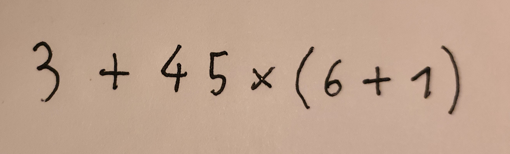
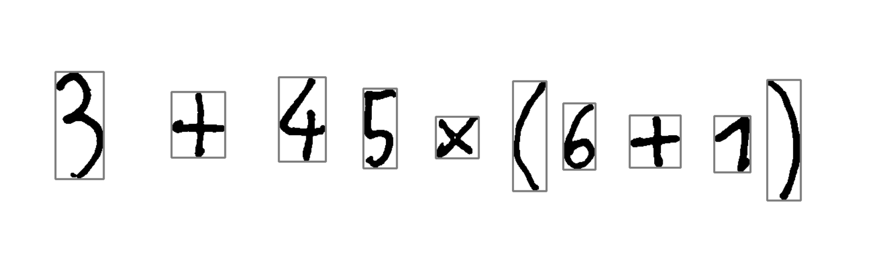

# OCR-math-solver

Simple python project for evaluation of handwritten mathematical expressions. Supports digits 0-9 and operators for addition, subtraction, multiplication, division, and brackets:
```
0123456789+-×/()
```

## Description
main.py takes one argument, -i or --image, path to image of handwritten expression. The image is processed and passed to optical character detector which cuts out individual characters and sends them to a simple CNN classifier. Expression constructed from classified characters is passed to an evaluator utilizing Shunting-Yard algorithm. Solution is printed to standard output.

## Installation and usage
Installation is possible with docker or manually. For Docker install within this directory use:
```
docker build --tag ocr-math-solver .    
docker run ocr-math-solver -i ./expression_examples/expression3.jpg
```
to install without Docker use:
```
pip3 install -r requirements.txt
```
```
python main.py --image | -i PATH_TO_IMAGE
```
for example:
```
python main.py -i ./expression_examples/expression3.jpg
```

## Visuals
Input expression:  
  
After preprocessing and character detection:  



